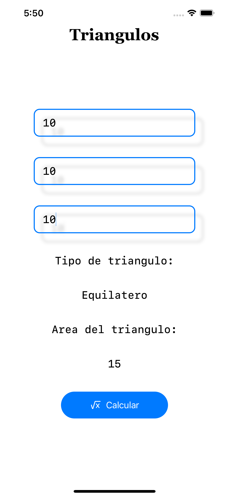
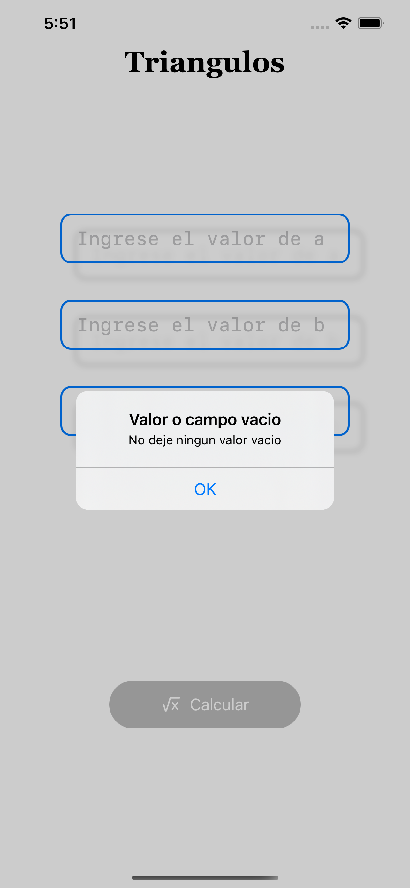

# Area de Triangulos
## Emilio Yoltic A01540484
> Lo que pasa cuando se llenan todos los campos solicitados 
> Este te regresa el area y el tipo de triangulo que es

>Si no se ponen todos los valores , este arrojara una alerta solicitando que se llenen todo los campos

